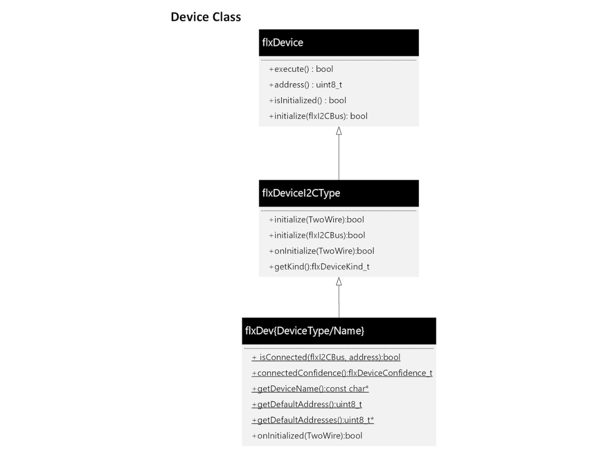
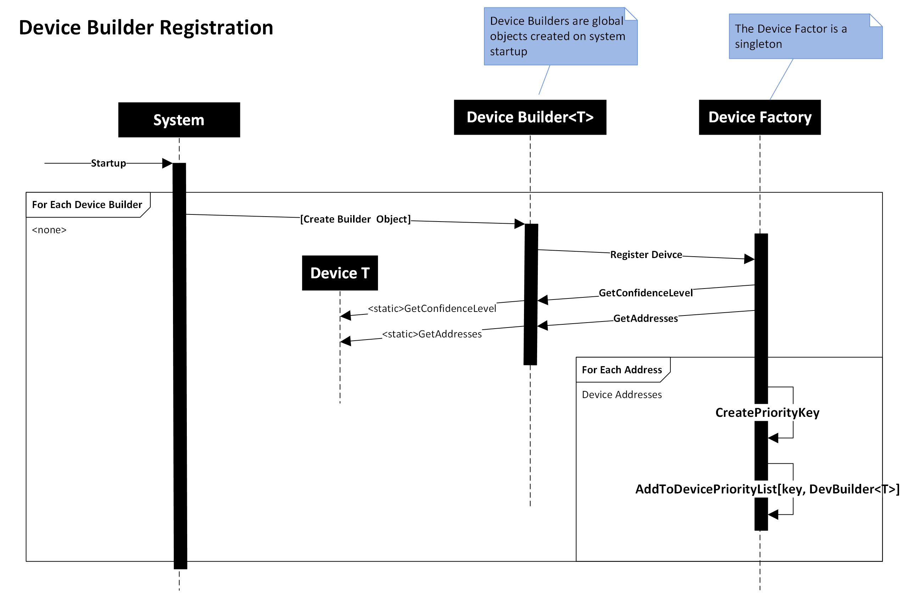

# Device Detection and Loading {#device_detection_loading}

One of the key features of the Flux framework is the ability to automatically detect and load different I2C devices, while placing minimal requirements on the device driver developer.

The key goals set for devices and auto load in the Flux framework include:

* Auto detection of devices connected to the I2C bus
* Device driver instantiation performed after the device is detected
* A device driver is self-describing, enabling device detection without device instantiation
* All information related to a device is maintained in the device driver - no outside registry or implementation is required or maintained.
* Device detection detection includes a method to resolve address conflicts

## Architecture Overview

To meet the goals for this subsystem, the Flux framework follows a ***Factory Pattern***, using device "builders" to describe a device, and a "factory" to manage the registration, detection and instantiation of devices using these device specific builders.

The key classes to support this pattern are:

| | |
|------|-------|
|**Device Driver** | The device specific driver, often implemented based on an existing Arduino Library |
|**Device Builder** | A device specific class that is automatically generated and used by the Framework to detect and instantiate a device |
|**Device Factory** | An overall singleton within the system that enables device registration at startup and device discovery, instantiation and initialization at runtime|

### Device Class

For device discovery and instantiation (not operation) the Device class in the Flux framework provides enough information for the Device Factory along with Device Builders to discover a device on the system and instantiate it.

To provide this introspection capability, while not requiring the actual instantiation of a device driver class, an "interface" of static methods are used for each class. As static methods, no actual device driver object is required to perform device - the static methods are just called.

The class hierarchy for the Device class is outlined in the following diagram:



#### Static Methods

The following **static** methods form the device discovery interface:

| | |
|----|----|
|```isConnected()``` | Called with an I2C bus object - should return true of the device is connected|
|```connectedConfidence()``` | Returns a confidence level to indicate the accuracy of the ```isConnected()``` algorithm used. Helpful when resolving device address conflicts|
|```getDeviceName()``` | Returns the name of the device - should be a static constant|
|```getDefaultAddress()``` | Returns the default I2C address for the device. *This method is deprecated*|
|```getDefaultAddresses()``` | Returns a list of I2C addresses the device can use. The first address should be the default address for the device. This array is terminated with the value ```kSparkDeviceAddressNull```|

#### Instance Methods

For the startup sequence the following instance methods are important
| | |
|------|--------|
|```onInitialize()``` | Called during the initialization process allowing the performance of the driver specific startup sequence. The Arduino TwoWire (Wire) object is passed in for use by the driver. Note: to get the address to use for the device, the driver calls the ```address()``` method.|
|```address()``` | Inherited - this method returns the address for the attached device|
|```isInitialized()``` | Returns true of the method ```onInitialized()``` returned true - indicating the driver is initialized.|

### Device Builder Class

This class provides a common interface for the Factory class to use during the discovery and instantiation phase of device creation. The class is defined as a template, with the only template parameter being the class name of the Driver it represents.

The template definition for the ```DeviceBuilder``` class:

```cpp
template <class DeviceType> class DeviceBuilder : public flxDeviceBuilderI2C
```

For the most part, all the methods in this class just wrap the *introspection* methods provided by the underlying Device class it represents. This allows allows the Factory class to work with object instances that bridge calls to the *static* methods of a Device object.

Example of a wrapped method in the ```DeviceBuilder``` template:

```cpp
bool isConnected(flxBusI2C &i2cDriver, uint8_t address)
{
    return DeviceType::isConnected(i2cDriver, address);
}
```

#### DeviceBuilder Instantiation

A goal of the Flux framework was to *automatically* register a device driver only by its implementation, not leveraging any external registration or implementation. The ```DeviceBuilder``` object is the key to meeting this goal.

In the implementation file of each device driver, a static ```global``` instance of the device drivers DeviceBuilder class is defined. Since all global objects are created during the system environment initialization, the DeviceBuilder can *register* itself with the Flux device Factory in its factory method. This is the ***trick*** to meeting the goal of device driver "auto registration".

The definition of the ```DeviceBuilder``` constructor:

```cpp
DeviceBuilder()
{
    flxDeviceFactory::get().registerDevice(this);
}
```

The Flux Factory class ```flxDeviceFactory``` is a *singleton*, and globally accessible. The first call to ```get()``` will create the only instance of the object, enabling creation at startup.

#### Developer Device Registration

To register a device driver, a static ```DeviceBuilder``` is added to the drivers implementation file.

```cpp
static DeviceBuilder<kDevice> global_##kDevice##Builder;
```

But to make this easier, the following macro is defined.

```cpp
#define flxRegisterDevice(kDevice) static DeviceBuilder<kDevice> global_##kDevice##Builder;
```

Using this macro, device registration looks like the following (using the BME280 driver)

```cpp
flxRegisterDevice(flxDevBME280);
```

Easy, and similar to other use patters throughout the Flux framework.

### Device Factory

The Flux Device Factory (```flxDeviceFactory```) is a singleton class that provides a single instance to manage device driver registration, device detection and device instantiation. Leveraging the common interface provided by the ```DeviceBuilder``` class, along with the static introspection methods each Device Driver implements, the Device Factory provides the key solution to meet the goals of the Flux framework driver auto load goals.

#### Implementation

A key implementation element of the Device Factory is a list of available device drivers - registered devices. The registration list contains all the Device Builders in the system, sorted by the I2C addresses they support. For each address a device supports, an entry in the registration list, mapping address to the Device Builder class.

Additionally, if multiple devices support the same address, the corresponding entries in the registration list are sorted by identification confidence level. The devices with a high confidence level appear earlier in the registration list for the specific address, ensuring those devices are check for existence before deices with lower detection confidence level methodologies.

When the auto load operation takes place, the Device Factory traverses the device registration list. For each address, the high confidence devices are evaluated first. Any discovered device is instantiated, initialized and added to the systems *active device list*.

The Factory operation consists of two major areas: Device Registration and Device AutoLoad.

##### Device Registration

As outlined earlier, when the system initializes the application environment, it instantiates the static DeviceBuilder class, which inturn registers themselves with the Device Factory. This process is outlined in the following sequence diagram:



The diagram outlines the following Device Registration steps:

1) The system instantiates a Device Builder class, that represents a driver class of type ```<T>```
2) In the *constructor* method of the Device Builder class, the *Register Device* method of the Device Factory is called, passing in *itself* as an argument.
3) The factory class retrieves the devices *confidence* level and list of supported i2c *addresses*
4) For each address the device supports, the following is performed
    * A device "priority" key is created. This is based off the address and confidence key and places higher confidence level devices higher in the sorted registrations list for a particular address.
    * A pointer to the Device Builder is inserted into the device registration list using the crated Priority Key
5) Once all addresses for a device is processed, the call to Register Device returns.

With all devices registering with the Factory at environment initialization, by the time Flux starts, all device drivers are registered and ready for the auto load operation.

#### Device Auto Load

The device auto load operation is initiated during application startup by the Flux framework by calling the ```buildDevices()``` method of the Device Factory. During this operation, the Device Factory traverses the sorted list of registered device, determines if a device is attached and if it is, creates the appropriate device driver. This process is outlined in the following sequence diagram:


The diagram outlines the following steps for device auto load:

1) The Flux frameworks calls the ```buildDevices()``` method on the Device Factory
2) The Factory Class traverses its internal registered device list - which contains an entry for each address a device supports.

For each entry in the registered device list:

1) Retrieves the address being evaluated - this is derived for the key used to store the Device Builder in the list.
2) Verifies the address is not is use. This can occur when devices are manually added to the Flux system
3) Queries the device driver to determine if the device is connected to the system by calling ```isConnected()``` and providing the address to check
4) If the device is connected:
    * A device driver instance is created
    * The runtime attributes for the driver are set (address, Name, auto load state)
    * The system calls the drivers ```initialize()``` method, passing in the I2C driver. This sets up the internal Flux state of the driver.
    * The base class of the driver calls the ```onInitialize()``` method of the driver, which performs device specific initialization of the driver
    * On initialization success, the driver adds itself to the Flux system, which adds the driver object to the frameworks list of connected devices.
5) Once all entries in the registered device list are checked, the Device Factory clears the registered device list, and releases any allocated resources. At this point in the Framework startup process, the factory is no-longer required.

### Summary

In summary, the I2C device auto load sequence of the Flux framework meets all goals for the subsystem by employing long-standing implementation patterns and leveraging the instantiation sequence of static/global objects.  

The implementation meets the goals set forth for the subsystem:

* Auto detection of devices connected to the I2C bus
* Device driver instantiation performed after the device is detected
* A device driver is self-describing, enabling device detection without device instantiation
* All information related to a device is maintained in the device driver - no outside registry or implementation is required or maintained.
* Device detection detection includes a method to resolve address conflicts

With the background in place for system operation, a device driver is easily implemented following the details outlined in the document [Writing a Device Driver](device_writing.md)
