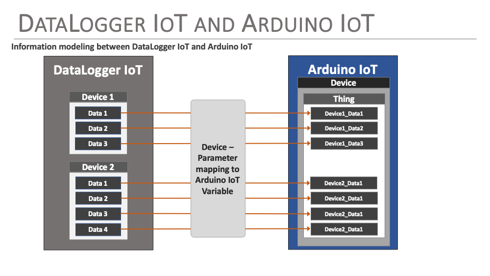
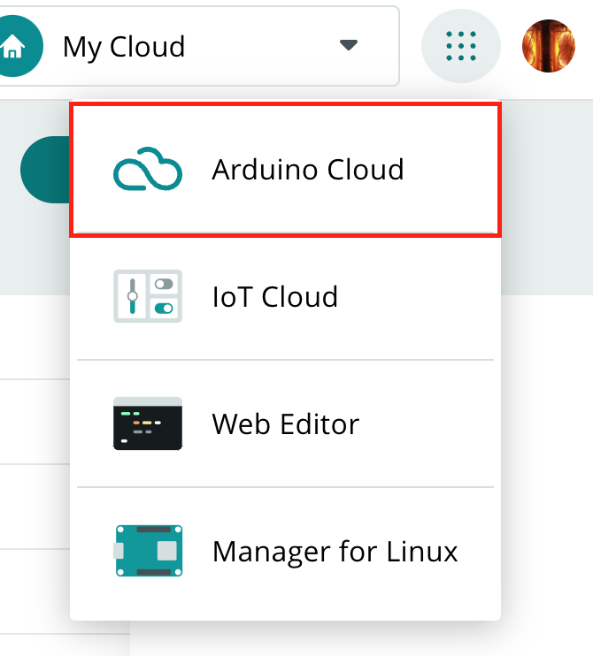
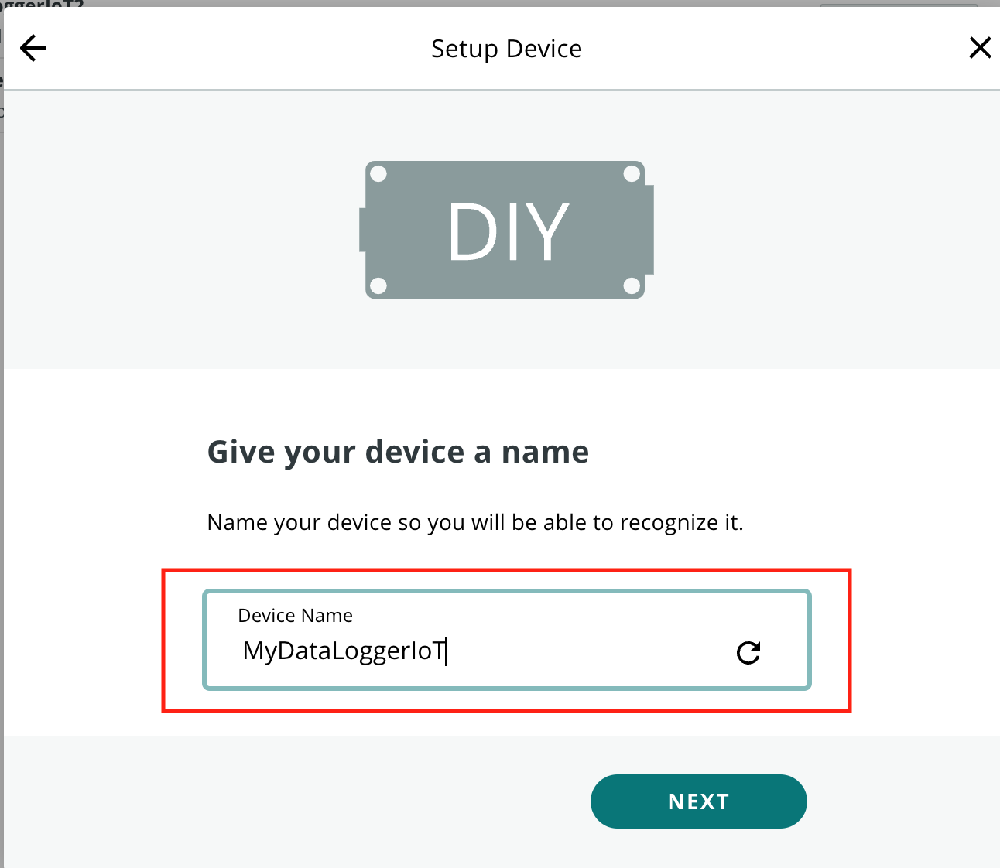
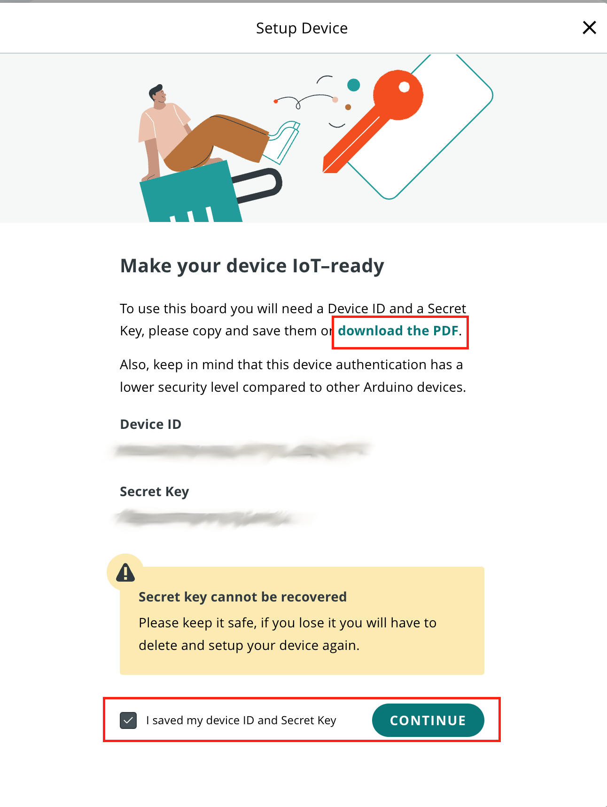
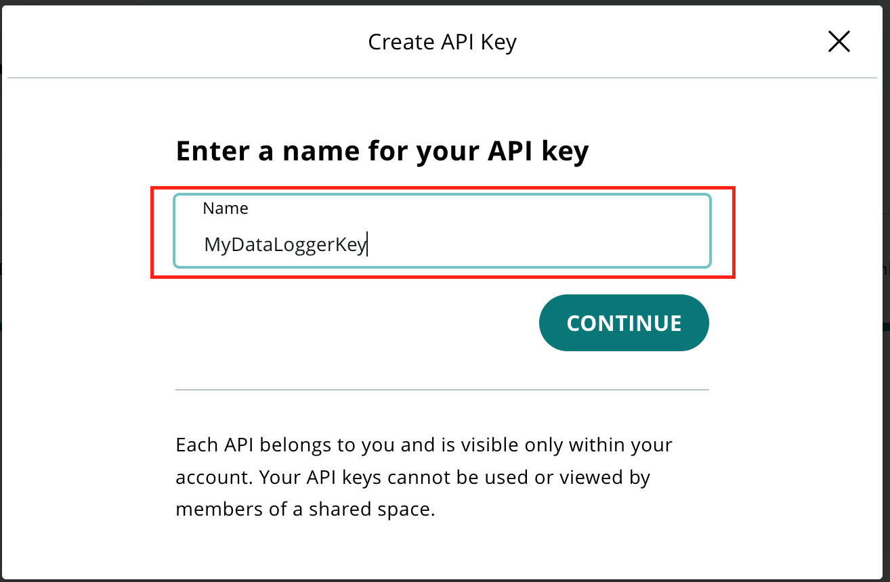
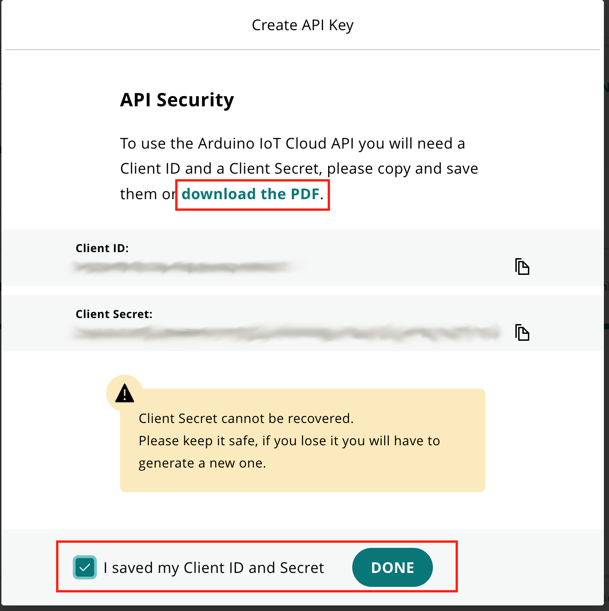

# Creating and Connecting to an Arduino IoT Device

One of the key features of the Flux Framework is it's simplified access to IoT service providers. This document outlines how an Arduino IoT Device is used by the Flux framework.

The following is covered by this document:

* Structure of the Arduino IoT Cloud devices
* Device creation in the Arduino IoT cloud
* Setup of the Arduino IoT driver
* How data is posted from the Flux Framework to the Arduino IoT Device

Currently, the Arduino IoT device connection is a single direction - used to post data from the hardware to the Arduino IoT Device. Configuration information from AWS IoT to the framework is currently not implemented.

## General Operation

The Arduino IoT Cloud enables connectivity between an IoT/Edge Arduino enabled device and the cloud. The edge device updates data in the Arduino Cloud by updating `variables` or parameters attached to a cloud device.

In the Arduino Cloud, the edge device is represented by a *Device* which has a virtual *Thing* attached/associated with it. The *Thing* acts as a container for a list of *parameters* or *variables* which represent the data values received from the edge device. As values on the edge device update, they are transmitted to the Arduino Cloud.

For a SparkFun Flux (DataLogger Iot for example) device connected to an Arduino IoT device, the output parameters of a device are mapped to variables within the Arduino IoT Devices Thing using a simple pattern of *DeviceName*_*ParameterName* for the name of the variable in the Arduino IoT Cloud.



## Creating a Device in Arduino IoT

The first step connecting to the Arduino IoT cloud is setting up a device within the cloud. A device is a logical element represents a physical device.

The first step is to login to your Arduino IoT cloud account and navigate to the Devices page on the IoT Cloud. This page lists your currently defined devices.



First select the *Add* button on the top of the page.


A device type selection dialog is then shown. Since we are connecting a DataLogger IoT board to the system, and not connected a known device, select **DIY** - *Any Device*.


Once selected, another dialog is presented. Just select *Continue*.

At this point you can provide a name for your device.



The next screen is the critical step of the device creation process. This step is the one time the Device Secret Key is available. The provided ```Device ID``` and Device ```Secret Key``` values are needed to connect to the Arduino IoT Cloud. Once this step is completed, the Secret Key is no longer available.



The easiest way to capture these values is by downloading as a PDF file, which is offered on the setup page.  

## Arduino Cloud API Keys

In addition to creating a device, to access the Arduino IoT Cloud, the driver requires a API Key. This allows the Flux Arduino IoT Cloud driver to access the web API of the Arduino Cloud. This API is used to setup the connection to the Arduino Cloud.

To create an API key, start at the **Arduino Cloud** [home page](https://cloud.arduino.cc/home/). From this page, select the *API keys* menu entry on the left side of the page.


This menu takes you to a list of existing API Keys. From this page, select the *CREATE API KEY* button, which is on the upper right of the page.


In the presented dialog, enter a name for the API key.



Once the name is entered and *CONTINUE* selected, a page with the new API key is presented. Like in Device Creation, this page contains a secret that is only available on this page during this process.



Make note of the *Client ID* and *Client Secret* values on this page. The best method to capture these values is to download the PDF file offered on this page.  

At this point, the Arduino IoT cloud is setup for connection by the driver.

## Adding an Arduino IoT Connection in the Flux Framework

To add an Arduino IoT device as a destination for the output of a Flux Framework based system, the application being created needs the following:

* Network Connectivity
* A source for JSON output from the device
*

For this example, we show out to connect the output of a data logger in the framework to the Arduino IoT device.

First - add an Arduino IoT framework to your object

```c++
// include our header
#include <Flux/flxIoTArduino.h>

// later in your code/header - declare an Arduino IoT object. 
// In this example, this is a class variable ...

// Arduino IoT
    flxIoTArduino _iotArduinoIoT;

During the setup of the framework - at initialization, the following steps finish the basic setup of the Arduino IoT object.

```c++
      // Connect the Arduino connection to the Wi-Fi connection being used.
    // Note: The framework will manage connect/disconnect events.
    _iotArduinoIoT.setNetwork(&_wifiConnection);

    // Finally, we add the iotArduinoIoT device to the JSON format output
    // from our data logger being used in this example. With this
    // connection made, when output is logged, the JSON version of
    // the output is passed to the Arduino connection.
    _fmtJSON.add(_iotArduinoIoT);
```

Once the Flux Arduino IoT object is integrated into the application, the specifics for the Arduino IoT Thing must be configured. This includes the following:

* Device ID and Secret
* API ID and Secret
* Thing Name
* Thing ID (optional)

### Device ID and Secret

These values are used to identify the Arduino IoT device that is connected to. These are obtained via the steps outlined earlier in this document.

### API ID and Secret

These values are used to provide API access by the driver. This access allows for the creation/use of a Thing and Variables within the Arduino IoT Cloud. These are obtained via the steps outlined earlier in this document.

### Thing Name

The name of the Arduino Iot Cloud ```Thing``` to use. If the Thing doesn't exist on startup, the driver will create the a Thing of this name.

### Thing ID

This is the ID of the Thing being used. This value is obtained by the following methods:

* If the driver creates a new Thing, the ID is obtained and used.
* If an existing Thing is connected to, the driver retrieves it's name. NOTE: In this case, the driver cannot create any new variables until the system is restarted.
* The user creates a new Thing using the web interface of Arduino IoT Cloud, and provides the *Thing ID* and *Thing Name*.

## Setting Properties

The above property values must be set on the Flux Arduino IoT object before use. They can be set in code, like any framework object property, or via a JSON file that is loaded by the system at startup. For the Flux Arduino IoT example outlined in this document, the entries in the settings JSON file are as follows:

```json
"Arduino IoT": {
    "Enabled": true,
    "Thing Name": "SparkFunThing1",
    "API Client ID": "API ID",
    "API Secret": "My API Secrete",
    "Device Secret": "My Device Secret",
    "Device ID": "My Device ID"            
  },
```

## Operation

Once the Flux-based device is configured and running, updates in Arduino IoT are listed in the ***Things*** tab of the Arduino IoT page. Clicking the target Thing provides access to the current variable values

One the first call to the ```write()``` method of the Arduino IoT driver, the driver initializes the connect to the cloud. This involves connecting to/creating a *Thing* and connecting to/creating *Variables* that map to the data values of the devices connected to the framework. This initialization step takes seconds to complete, but once performed, each data update step progresses quickly.
