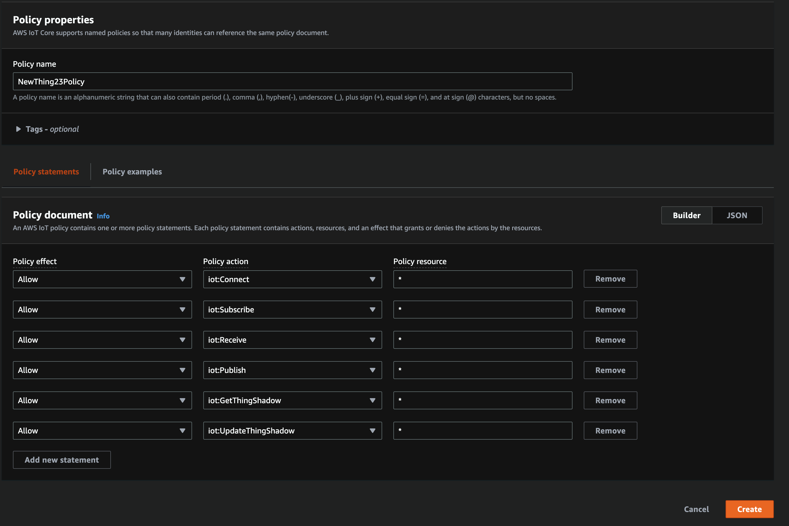
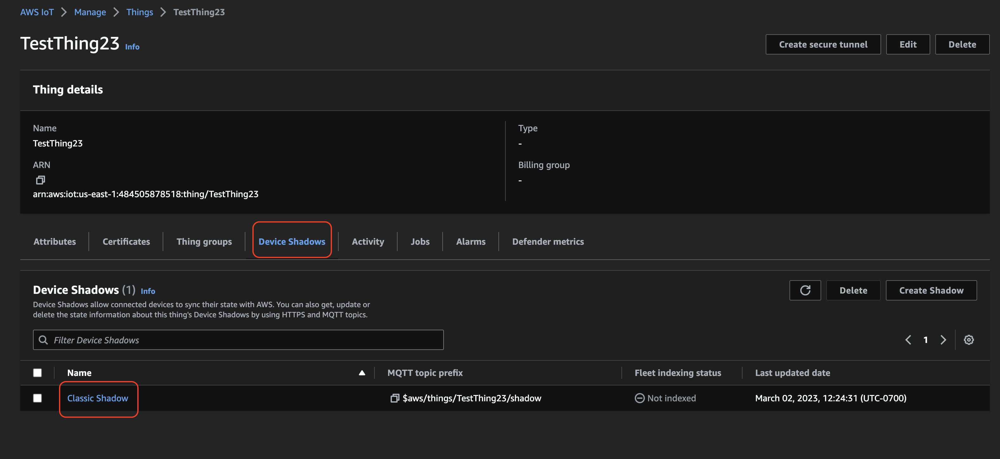

# Creating and Connecting to an AWS IoT Device (Thing)

One of the key features of the Flux Framework is it's simplified access to IoT service providers. This document outlines how an AWS IoT device is used by the Flux framework. 

The following is covered by this document:
* Device (Thing) creation in AWS
* Adding a device to a Flux Framework Device
* Securely connecting the device
* How data is posted from the Flux Framework to the AWS Device via it's Shadow

Currently, the AWS IoT device connection is a single direction - used to post data from the hardware to the IoT AWS Device via the AWS IoT devices **shadow**. Configuration information from AWS IoT to the framework is currently not implemented.

## General Operation

AWS IoT enables connectivity between an IoT / Edge device and the AWS Cloud Platform, implementing secure endpoints and device models within the AWs infrastructure. This infrastructure allows edge devices to post updates, status and state to the AWS infrastructure for analytics, monitoring and reporting. 

In AWS IoT, an virtual representation of an actual device is created and referred to as a *Thing*. The virtual device/Thing is allocated a connection endpoint, security certificates and a device **shadow** - a JSON document used to persist, communicate and manage device state within AWS. 

The actual IoT device communicates with it's AWS representation via a secure MQTT connection, posting JSON document payloads to a set of pre-defined topics. Updates are posted to the AWS IoT device **shadow**, which is then accessed within AWS for further process as defined by the users particular cloud implementation. 


## Creating a Device in AWS IoT
The following discussion outlines the basic steps taken to create a Thing in AWS IoT that the Flux Framework can connect to. 

First step is to log into your AWS account and Select **IoT Core** from the menu of services.


From the IoT Core console page, under the **Manage** section, select **All Devices > Things**  

On the resultant Things Page, select the **Create Things** button.


AWS IoT will then take you through the steps to create a device. Selections made for a demo Thing are:
* Create single thing
* Thing Properties 
    - Enter a name for your thing - for this example ***TestThing23***
    - Device Shadow - select ***Unnamed shadow (classic)***
* Auto-generate a new certificate
* Attach policies to certificate - This is discussed later in this document 
* Select **Create thing**

Upon creation, AWS IoT presents you with a list of downloadable certificates and keys. Some of these are only available at this step. The best option is to download everything presented - three of these are used by the Flux AWS IoT connector.  The following should be downloaded:
* Device Certificate
* Public Key File
* Private Key File
* Root CA certificates - (for example:  Amazon Root CA 1 )

At this point, the new AWS IoT thing is created and listed on the AWS IoT Things Console


### Security Policy
To write to the IoT device, a security policy that enables this is needed, and the policy needs to be assigned to the devices certificate.

To create a Policy, select the ***Manage > Security > Policies*** menu item from the left side menu of the AWS IoT panel. Once on this page, select the **Create policy** button to create a new policy.


When entering the policy, provide a name that fits your need. For this example the name **NewThing23Policy** is used. For the Policy document, you can manually enter the security entires, or enter them as a JSON document. The JSON document used for this example is:

```json
{
  "Version": "2012-10-17",
  "Statement": [
    {
      "Effect": "Allow",
      "Action": "iot:Connect",
      "Resource": "*"
    },
    {
      "Effect": "Allow",
      "Action": "iot:Subscribe",
      "Resource": "*"
    },
    {
      "Effect": "Allow",
      "Action": "iot:Receive",
      "Resource": "*"
    },
    {
      "Effect": "Allow",
      "Action": "iot:Publish",
      "Resource": "*"
    },
    {
      "Effect": "Allow",
      "Action": "iot:GetThingShadow",
      "Resource": "*"
    },
    {
      "Effect": "Allow",
      "Action": "iot:UpdateThingShadow",
      "Resource": "*"
    }
  ]
}
```



Once the policy is created, go back to the IoT Device/Thing created above and associate this policy to the device Certificate.

* Go to your device ***Manage > All devices > Things***
* Select the device - ***TestThing23** for this example
* Select the ***Certificates*** tab
* Select the listed Certificate (it's a very long hex number)
* At the bottom right of the page, select the ***Attach policies*** button and select the Policy created above. 


At this point, AWS IoT is ready for a device to connect and receive data. 

## Adding an AWS IoT Connection in the Flux Framework

To add an AWS IoT device as a destination for the output of a Flux Framework based system, the application being created needs the following:
* Network Connectivity
* A source for JSON output from the device
* A source to store the security keys/certificates needed to connect to the AWS IoT device. 

For this example, we show out to connect the output of a data logger in the framework to the AWS IoT device. 

First - add an AWS IoT framework to your object

```c++
// include our header
#include <Flux/flxIoTAWS.h>

// later in your code/header - declare an AWS IoT object. 
// In this example, this is a class variable ...

// AWS
    flxIoTAWS _iotAWS;
```
During the setup of the framework - at initialization, the following steps finish the basic setup of the AWS object.

```c++
    // AWS - give the object a name and description
    _iotAWS.setName("AWS IoT", "Connect to an AWS Iot Thing");

    // Connect the AWS connection to the Wi-Fi connection being used.
    // Note: The framework will manage connect/disconnect events.
    _iotAWS.setNetwork(&_wifiConnection);

    // certs/keys could be added manually (if they were static arrays in
    // the application code) In this example, we load them in via an
    // attached SD card, so we connect the fileSystem to the AWS object.
    // The AWS object is provided filenames, an automatically loads 
    // the keys/value

    // Add the filesystem to load certs/keys from the SD card
    _iotAWS.setFileSystem(&_theSDCard);

    // Finally, we add the iotAWS device to the JSON format output
    // from our data logger being used in this example. With this
    // connection made, when output is logged, the JSON version of
    // the output is passed to the AWS connection, and then posted
    // to the AWS IoT device.
    _fmtJSON.add(_iotAWS);
```

Once the Flux AWS IoT object is integrated into the application, the specifics for the AWS IoT Thing must be configured. This includes the following:
* Server name/host 
* MQTT topic to update
* Client Name - The AWS IoT Thing Name
* CA Certificate chain
* Client Certificate
* Client Key

### Server Name/Hostname
This value is obtained from the AWS IoT Device page for the created device. When on this page, select the ***Device Shadows*** tab, and then select the ***Classic Shadow** shadow, which is listed.


Selecting the ***Classic Shadow** entry provides the Server Name/Hostname for the device, as well as the MQTT topic for this device.


Note: The server name is obtained from the Device Shadow URL entry

### MQTT Topic
The MQTT topic value is based uses the ***MQTT topic prefix*** from above, and has the value ***update** added to it. So for this example, the MQTT topic is: 
``` $aws/things/TestThing23/shadow/update```

### Client Name
This is the AWS IoT name of the thing. For the provided example, the value is ***TestThing23***

### CA Certificate chain
This value was downloaded as a file during the creation process. The contents of this file can be defined as a static array in a source file and passed in to the Flux AWS IoT object directly, or by copying the file containing the data onto a devices SD Card and setting the filename property on the Flux AWS IoT object.

### Client Certificate
This value was downloaded as a file during the creation process. The contents of this file can be defined as a static array in a source file and passed in to the Flux AWS IoT object directly, or by copying the file containing the data onto a devices SD Card and setting the filename property on the Flux AWS IoT object.

### Client Key
This value was downloaded as a file during the creation process. The contents of this file can be defined as a static array in a source file and passed in to the Flux AWS IoT object directly, or by copying the file containing the data onto a devices SD Card and setting the filename property on the Flux AWS IoT object.

## Setting Properties
The above property values must be set on the Flux AWS IoT object before use. They can be set in code, like any framework object property, or via a JSON file that is loaded by the system at startup. For the Flux AWS IoT example outlined in this document, the entries in the settings JSON file are as follows:

```json
"AWS IoT": {
    "Enabled": false,
    "Port": 8883,
    "Server": "avgpd2wdr5s6u-ats.iot.us-east-1.amazonaws.com",
    "MQTT Topic": "$aws/things/TestThing23/shadow/update",
    "Client Name": "TestThing23",
    "Buffer Size": 0,
    "Username": "",
    "Password": "",
    "CA Certificate": "",
    "Client Certificate": "",
    "Client Key": "",
    "CA Cert Filename": "AmazonRootCA1.pem",
    "Client Cert Filename": "TestThing23_DevCert.crt",
    "Client Key Filename": "TestThing23_Private.key"
  },
```

## Operation
Once the Flux-based device is configured and running, updates in AWS IoT are listed in the ***Activity*** tab of the devices page. For the test device in this document, this page looks like:


Opening up an update, you can see the data being set to AWS IoT in a JSON format.

