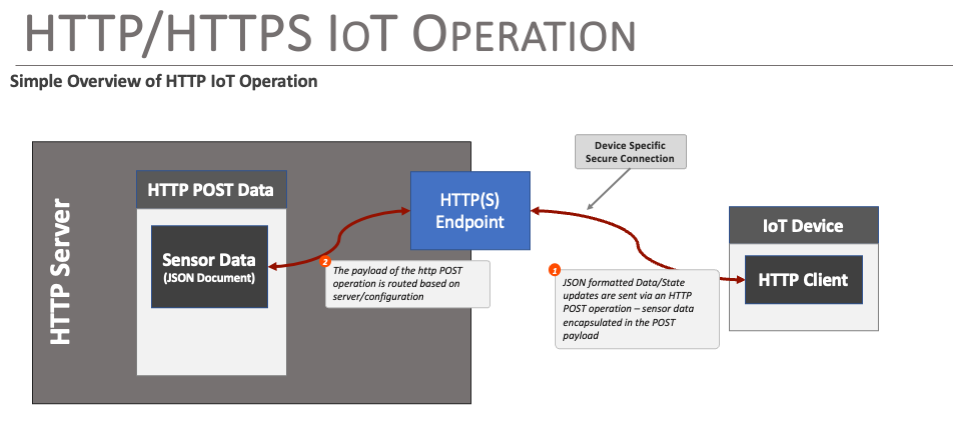
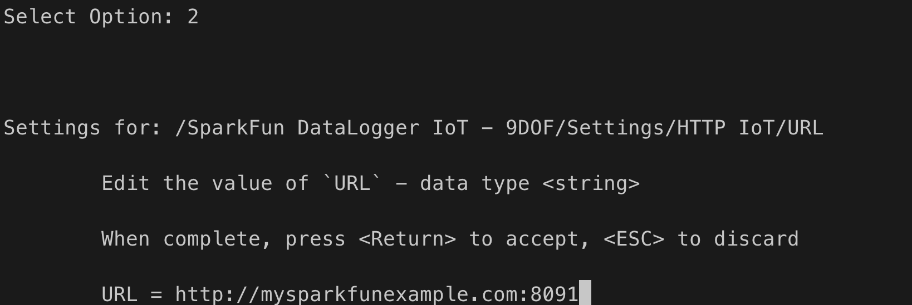
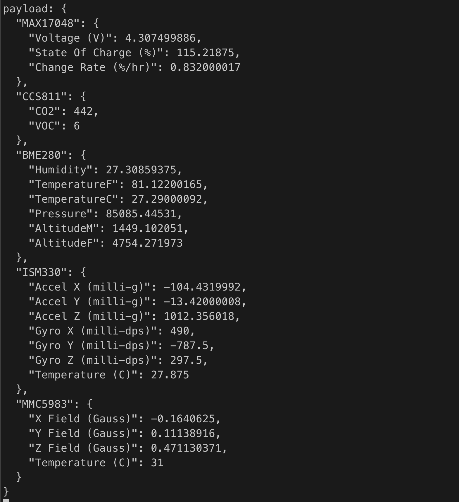
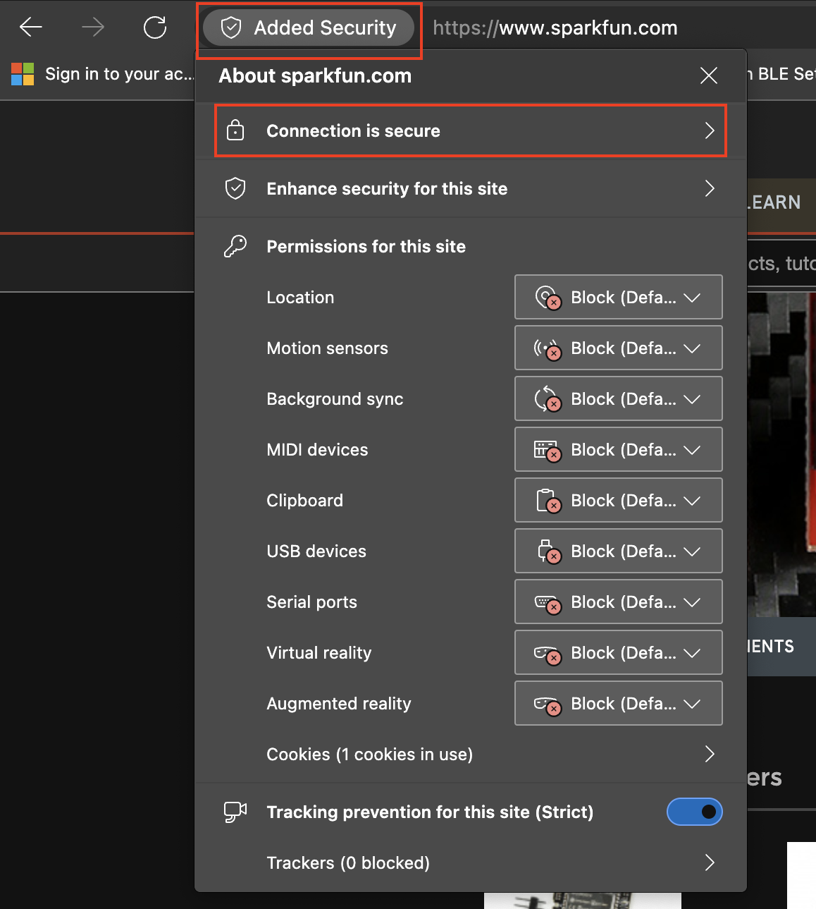
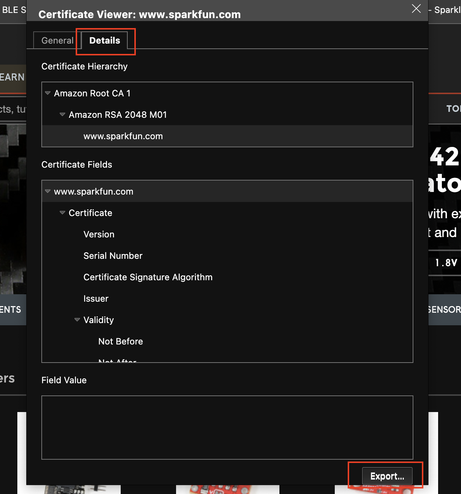

# Sending Output to an HTTP Server {#flux-using-iot-http}

One of the key features of the Flux Framework is it's simplified access to IoT service providers and servers. This document outlines how output from a Flux/DataLogger device is sent to an HTTP server.

The following is covered by this document:

* Overview of the HTTP connection
* How a user configures and uses the HTTP connection
* Use examples
* Development use of the HTTP connection in Flux

## General Operation

HTTP connectivity allows data generated by the DataLogger/Flux framework to be sent to an HTTP server. An HTTP endpoint is provided to the HTTP action within the framework, and when data is output, a JSON representation of the data is published to the endpoint via an HTTP POST operation. The body of the POST operation contains the a JSON document that encapsulates the sent Flux/DataLogger data.



### Data Structure

Data is sent to the HTTP server as a JSON object, which contains a collection of sub-object. Each sub-object represents a data source in the Flux framework (sensor), and contains the current readings from that source.

The following is an n example of the data posted - note, this representation was "pretty printed" for readability.

```json
{
  "MAX17048": {
    "Voltage (V)": 4.304999828,
    "State Of Charge (%)": 115.0625,
    "Change Rate (%/hr)": 0
  },
  "CCS811": {
    "CO2": 620,
    "VOC": 33
  },
  "BME280": {
    "Humidity": 25.03613281,
    "TemperatureF": 79.64599609,
    "TemperatureC": 26.46999931,
    "Pressure": 85280.23438,
    "AltitudeM": 1430.44104,
    "AltitudeF": 4693.04834
  },
  "ISM330": {
    "Accel X (milli-g)": -53.31399918,
    "Accel Y (milli-g)": -34.03800201,
    "Accel Z (milli-g)": 1017.236023,
    "Gyro X (milli-dps)": 542.5,
    "Gyro Y (milli-dps)": -1120,
    "Gyro Z (milli-dps)": 262.5,
    "Temperature (C)": 26
  },
  "MMC5983": {
    "X Field (Gauss)": -0.200622559,
    "Y Field (Gauss)": 0.076416016,
    "Z Field (Gauss)": 0.447570801,
    "Temperature (C)": 29
  }
}
```

## HTTP Connection Setup

To connect to an HTTP server endpoint, the following information is needed:

* The URL of the endpoint
* The SSL certificate for the target server, if the connection is secure (HTTPS)

These values are set using the standard Flux/DataLogger methods - the interactive menu system, or a JSON file.

### Menu System

When the menu system for the HTTP connection is presented, the following options are displayed:


The options are:

* Enable/Disable the connection
* Set the URL for the endpoint
* Set the name of the CA Cert file for a secure connection (HTTP)

To set the HTTP URL/endpoint - select two (2) in the menu, and enter the URL.



In the above example, the URL/HTTP Endpoint is on a server called `mysparkfunexample.com`, on port `8091`. Once set, the system will post data to this URL.

If the endpoint is a secure ssl (HTTPS) connection, the certificate for the server is required. Because of the size of the certificates, the value is provided as a file that is loaded into the system by the attached SD card.


The above example show providing a certificate filename of `example.cer`.

Once all these values are set, the system will post data to the specified HTTP endpoint, following the JSON information structure noted earlier in this document.

### JSON File Entries

If a JSON file is being used as an option to import settings into the Flux framework application/DataLogger, the following entries are used for the HTTP IoT connection:

```json
"HTTP IoT": {
    "Enabled": false,
    "URL": "<the URL>",
    "CA Cert Filename": "<certificate filename"
  }
```

Where:

* `Enabled` - set to true to enable the connection
* `URL` - Set to the URL for the connection
* `CA Cert Filename` - set to the cert filename on the SD card if being used.

## Example - Connecting to a HTTP Server

In this example, a simple HTTP Server is creating using Node JS, and the HTTP connection in the SparkFun DataLogger IoT is used to post data to this server. The received data is output to the console from there server.

### The Server

The following javascript/node code creates a HTTP server on port 8090, and outputs received data to the console.

```javascript
var http = require('http');

// Setup the endpoint server
var myServer = http.createServer(function (req, res) {

  // Initialize our body string
  var body="";

  // on data callback, append chunk to our body string
  req.on('data', function(chunk){
 body += chunk;
  });

  // On end callback, output the body to the console
  req.on('end', function(){
    // parse json string, then stringify it back for 'pretty printing'
    console.log("payload: " + JSON.stringify(JSON.parse(body),null,2));
  });

  // send a reply
  res.writeHead(200, {'Content-Type': 'text/plain'});
  res.end('n');
  // Just listen on our port
}).listen(8090);
```

The setup and use of node js is system dependant is beyond the scope of this document. However, Node JS is easily installed with your systems package manager (`brew` on macOS, Linux distribution package manager (apt, yum, ...etc), on Windows, the WSL is recommended).

Once Node is setup, the above server is run via the following command (assuming the implementation is in a file called `simple_http.js`):

```sh
node ./simple_http.js
```

As data is sent by the Flux Application/DataLogger IoT, the following is output to the console from the server:



## Obtaining a Sites Security Certificate

Accessing a sites SSL/Secure Certificate is done via a web browser. The method for each browser is different. The following example uses Edge, which is similar to the operation in Chrome.

First, browse to the desired site/server. Click the Secure/Security area/button next to the URL to bring up the security detail page.



On this page select the *Connection is secure* menu option

Next, on the page shown, select the certificate button on the upper right of the dialog.


When you select this button, the certificate details dialog is displayed.



On this page, select the *Details* tab, and select the *Export...* button on the lower right of the dialog. This will save the sites SSL/Security certificate to a location you specify.

Once saved, place this file on the SD card your system/DataLogger is using, and set the filename in the HTTP connection menu or settings JSON file.

## Adding an HTTP IoT Connection in the Flux Framework

To add an HTTP IoT device as a destination for the output of a Flux Framework based system, the application being created needs the following:

* Network Connectivity
* A source for JSON output from the device
* A source to store the security key/certificate needed to connect to the HTTP IoT device.

For this example, we show out to connect the output of a data logger in the framework to the HTTP IoT device.

First - add an HTTP IoT framework to your object

```c++
// include our header
#include <Flux/flxIoTHTTP.h>

// later in your code/header - declare an HTTP IoT object. 
// In this example, this is a class variable ...

// HTTP
    flxIoTHTTP _iotHTTP;
```

During the setup of the framework - at initialization, the following steps finish the basic setup of the HTTP object.

```c++
    
    // Connect the HTTP connection to the Wi-Fi connection being used.
    // Note: The framework will manage connect/disconnect events.
    _iotHTTP.setNetwork(&_wifiConnection);

    //  In this example, we load the cert file in via an
    // attached SD card, so we connect the fileSystem to the HTTP object.
    // The HTTP object is provided the filename, an automatically loads 
    // the keys/value

    // Add the filesystem to load certs/keys from the SD card
    _iotHTTP.setFileSystem(&_theSDCard);

    // Finally, we add the iotHTTP device to the JSON format output
    // from our data logger being used in this example. With this
    // connection made, when output is logged, the JSON version of
    // the output is passed to the HTTP connection, and then posted
    // to the HTTP server.
    _fmtJSON.add(_iotHTTP);
```
