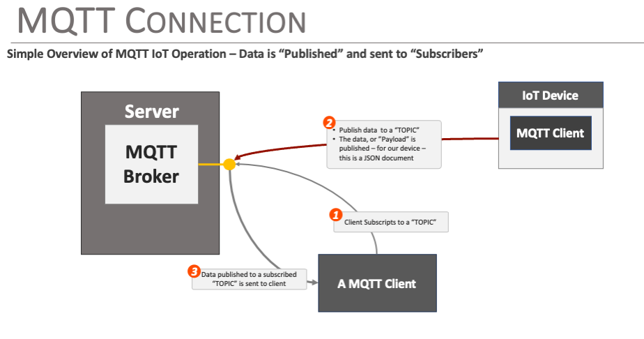
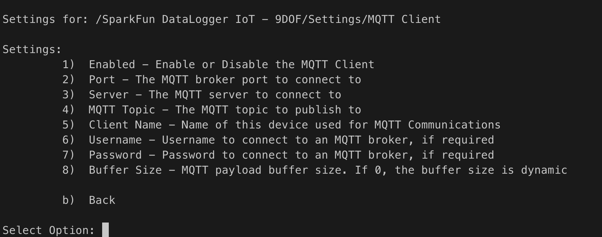

# Connecting and Publishing DAta to MQTT

One of the key features of the Flux Framework is it's simplified access to IoT service providers and servers. This document outlines how output from a Flux/DataLogger device is sent to an MQTT Broker.

The following is covered by this document:

* Overview of the MQTT connection
* How a user configures and uses the MQTT connection
* MQTT examples
* Development use of the MQTT connection in Flux

## General Operation

MQTT connectivity allows data generated by the DataLogger/Flux framework to be published to an MQTT Broker under a user configured topic. MQTT is an extremely flexible and low overhead data protocol that is widely used in the IoT field.

The general use pattern for MQTT is that data is *published* to a *topic* on a MQTT broker. The data is then sent to any MQTT client that has subscribed to the specified *topic*.



A Flux Framework application (DataLogger IoT) supports MQTT connections, allowing an end user to enter the parameters for the particular MQTT Broker for the application to publish data to. When the application outputs data to the broker, the Flux framework publishes the available information to the specified "topic" with the payload that is a JSON document.

### Data Structure

Data is published to the MQTT broker as a JSON object, which contains a collection of sub-object. Each sub-object represents a data source in the Flux framework (sensor), and contains the current readings from that source.

The following is an n example of the data posted - note, this representation was "pretty printed" for readability.

```json
{
  "MAX17048": {
    "Voltage (V)": 4.304999828,
    "State Of Charge (%)": 115.0625,
    "Change Rate (%/hr)": 0
  },
  "CCS811": {
    "CO2": 620,
    "VOC": 33
  },
  "BME280": {
    "Humidity": 25.03613281,
    "TemperatureF": 79.64599609,
    "TemperatureC": 26.46999931,
    "Pressure": 85280.23438,
    "AltitudeM": 1430.44104,
    "AltitudeF": 4693.04834
  },
  "ISM330": {
    "Accel X (milli-g)": -53.31399918,
    "Accel Y (milli-g)": -34.03800201,
    "Accel Z (milli-g)": 1017.236023,
    "Gyro X (milli-dps)": 542.5,
    "Gyro Y (milli-dps)": -1120,
    "Gyro Z (milli-dps)": 262.5,
    "Temperature (C)": 26
  },
  "MMC5983": {
    "X Field (Gauss)": -0.200622559,
    "Y Field (Gauss)": 0.076416016,
    "Z Field (Gauss)": 0.447570801,
    "Temperature (C)": 29
  }
}
```

## MQTT Broker Connection Setup

To connect to a MQTT Broker, the following information is needed:

* The server name/address
* The server port
* The topic to post to
* [*optional*] The name of the device/Client name publishing the data
* [*optional*] A username - if required
* [*optional*] A password - if required

These values are set using the standard Flux/DataLogger methods - the interactive menu system, or a JSON file.

### Menu System

When the menu system for the MQTT connection is presented, the following options are displayed:



The options are:

* Enable/Disable the connection
* Broker Port - The standard port for mqtt is 1883
* Broker Server - This is just the name of the server
* MQTT Topic - A string
* Client Name
* Username
* Password
* Buffer Size

At a minimum, the Port, Server Name and Topic need to be set. What parameters are required depends on the settings of the broker being used.

> If a secure connection is being used with the MQTT broker, use the `MQTT Secure Client` option of the Framework/Application. This option supports secure connectivity.

> The `Buffer Size` option is **dynamic** by default, adapting to the size of the payload being sent. If runtime memory is a concern, set this value to a static size that supports the device operation.

Once all these values are set, the system will publish data to the specified MQTT Broker, following the JSON information structure noted earlier in this document.

### JSON File Entries

If a JSON file is being used as an option to import settings into the Flux framework application/DataLogger, the following entries are used for the MQTT IoT connection:

```json
"MQTT Client": {
    "Enabled": false,
    "Port": 1883,
    "Server": "my-mqttserver.com",
    "MQTT Topic": "/sparkfun/datalogger1",
    "Client Name": "mysensor system",
    "Buffer Size": 0,
    "Username": "",
    "Password": ""
  },
```

Where:

* `Enabled` - set to true to enable the connection
* `Port` - Set to the broker port
* `Server` - The MQTT broker server
* `MQTT Topic` - The topic to publish to
* `Client Name` - optional client name
* `Buffer Size` - internal transfer buffer size
* `Username` - Broker user name if being used
* `Password` - Broker password if being used

## Testing the MQTT Connection

Use of a MQTT connection is fairly straightforward - just requiring the entry of broker details into the connection settings.

To test the connection, you need a MQTT broker available. A quick method to setup a broker is by installing the `mosquitto` package on a Raspberry Pi computer. Our basic [MQTT Tutorial](https://learn.sparkfun.com/tutorials/introduction-to-mqtt) provides some basic setup for a broker. [This MQTT Broker Tutorial](https://randomnerdtutorials.com/how-to-install-mosquitto-broker-on-raspberry-pi/) has more details, covering the setup needed for modern mosquitto configurations.

And once the broker is setup, the messages published by the IoT sensor are visible using the `mosquitto_sub` command as outlined. For example to view messages posted to a the topic "/datalogger/logger1", the following command is used:

```sh
mosquitto_sub -t '/datalogger/logger1'
```

This assumes the MQTT broker is running on the same machine, and using the default port number.

## Adding an MQTT IoT Connection in the Flux Framework

To add an MQTT IoT device as a destination for the output of a Flux Framework based system, the application being created needs the following:

* Network Connectivity
* A source for JSON output from the device

For this example, we show out to connect the output of a data logger in the framework to the MQTT IoT device.

First - add an MQTT IoT framework to your object

```c++
// include our header
#include <Flux/flxMQTTESP32.h>

// later in your code/header - declare an MQTT IoT object. 
// In this example, this is a class variable ...

// MQTT
    flxMQTTESP32 _mqttClient;
```

During the setup of the framework - at initialization, the following steps finish the basic setup of the MQTT object.

```c++
    
    // Connect the MQTT connection to the Wi-Fi connection being used.
    // Note: The framework will manage connect/disconnect events.
    _mqttClient.setNetwork(&_wifiConnection);

    // Finally, we add the MQTT device to the JSON format output
    // from our data logger being used in this example. With this
    // connection made, when output is logged, the JSON version of
    // the output is passed to the MQTT connection, and then published
    // to the MQTT Broker.
    _fmtJSON.add(_mqttClient);
```

