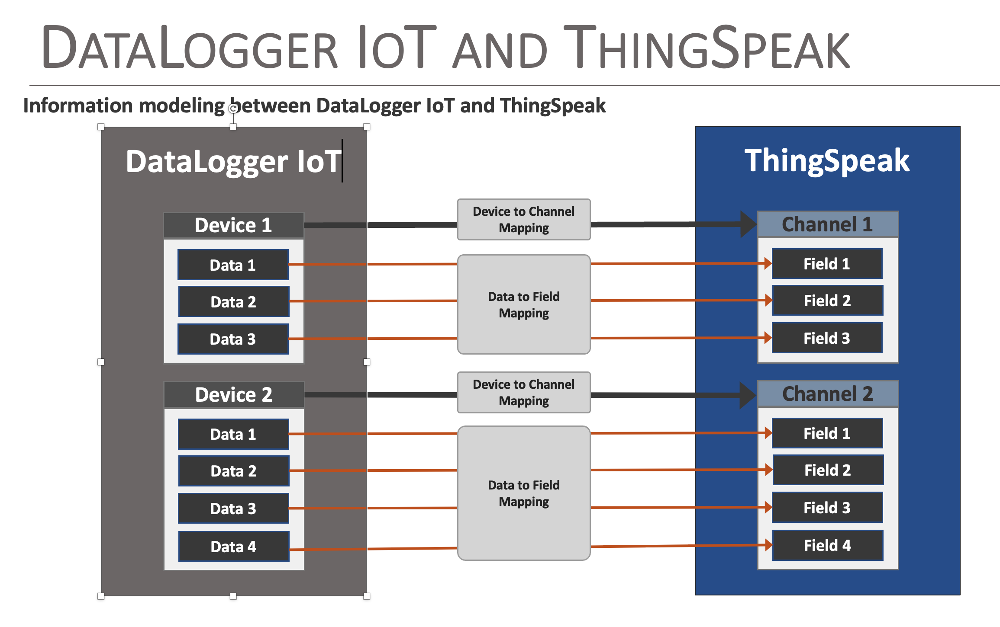
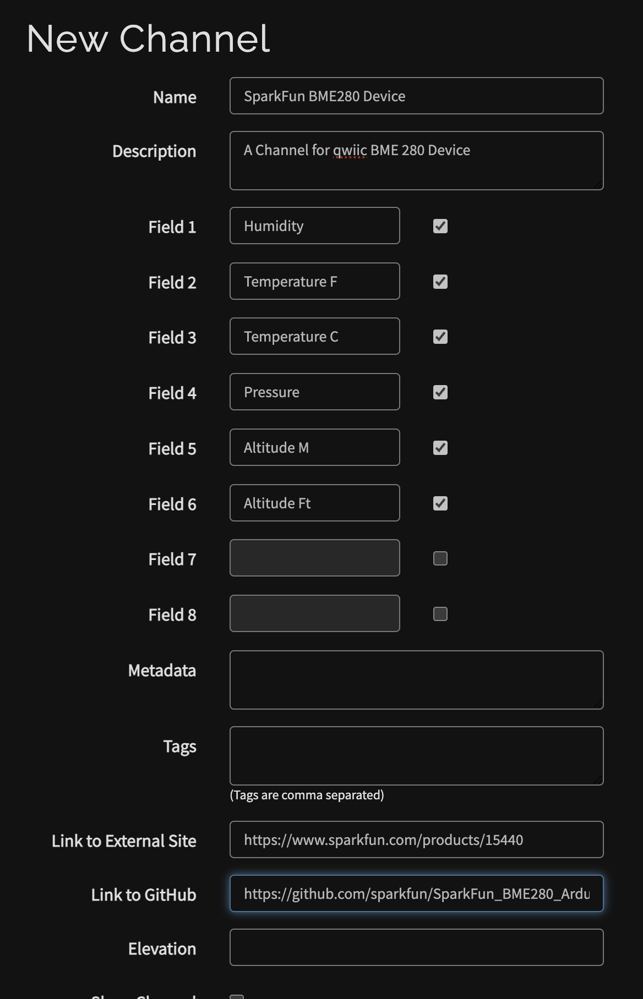
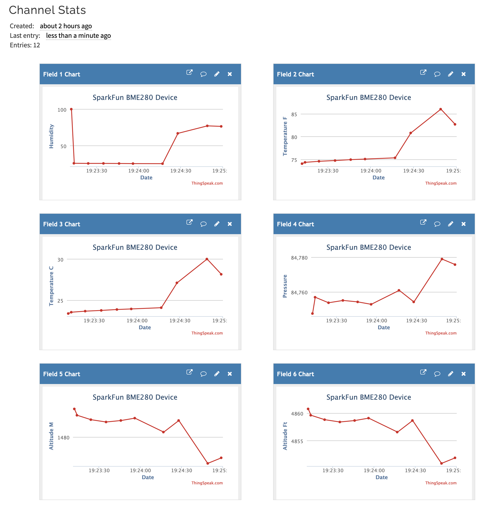

# Creating and Connecting to ThingSpeak

One of the key features of the Flux Framework is it's simplified access to IoT service providers. This document outlines how a ThinkSpeak output is used by the Flux framework

The following is covered by this document:

* Creating a ThingSpeak Channel and MQTT Connection
* Adding ThingSpeak output to a Flux Framework Device
* Securely connecting the ThingSpeak
* How data is posted from the Flux Framework to ThingSpeak

## General Operation

### ThingSpeak Structure

The structure of ThingSpeak is based off of the concept of ***Channels**, with each channel supporting up to eight fields for data specific to the data source. Each channel is named, and has a unique ID associated with it.  One what to think of it is that a Channel is a grouping of associated data values or fields. 

The fields of a channel are enumerated as ***Field1, Field2, ..., Field8**, but each field can be named to simplify data access and understanding.

As data is reported to a ThingSpeak channel, the field values are accessible for further processing or visualization output.

### Flux Framework Data Structure

The Flux Framework is constructed around the concept of ***Devices*** which are often a type of Sensor that can output a set of data values per observation or sample.

### Mapping Flux Device Data to ThingSpeak

The concept of Channels that contain Fields in ThingSpeak is similar to the Devices that contain Data within Flux, and this similarity is the mapping model used by the Flux ThingSpeak connector. Specifically:

* **Devices == Channels**
* **Data == Fields**



During configuration of the Flux ThingSpeak connector, the mapping between the Flux Device and ThingSpeak channel is specified. The data to field mapping is automatically created by Flux following the data reporting order from the specific Flux device driver. 

## Creating a Flux Device to a ThingSpeak Channel

The following discussion outlines the basic steps taken to create a Channel in ThingSpeak and then connect it to a Flux Device. 

First step is to log into your ThingSpeak and create a Channel. Once logged into your ThingSpeak account, select ***Channels > My Channels*** menu item and on the **My Channel** page, select the **New Channel** button.


On the presented channel page, name the channel and fill in the specific channel fields. The fields should map to the data fields reported from the Flux Device being linked to this channel. Order is important, and is determined by looking at output of a device to the serial device (or reviewing the device driver code). 



Once the values are entered, select save. ThingSpeak will now show list of **Channel Stats*, made up of line plots for each field specified for the channel.

Key note - at the top of this page is listed the **Channel ID**. Note this number - it is used to map a Flux Device to a ThingSpeak Channel.

### Setting up ThingSpeak MQTT

The Flux ThingSpeak connector uses MQTT to post data to a channel. From the ThingSpeak menu, select ***Devices > MQTT***, which display a list of your MQTT devices. From this page, select the **Add a new device** button. 

On the presented dialog, enter a name for the MQTT connection and in the **Authorize channels to access**, select the channel created earlier. Note: More channels can be added later. Once you select a channel, click the **Add Channel** button. The selected Channel is then listed in the **Authorized Channel** table. Ensure that the Allow Publish and Allow Subscribe attributes are enabled for the added channel.


**NOTE**

>When the MQTT device is created, a set of credentials (Client ID, Username and Password) is provided. **Copy or download** these values, since the password in not accessible after this step.


Channel Authorization.

At this point, the ThingSpeak Channel is setup for access by the Flux ThingSpeak connector.


## Adding the ThingSpeak Connector in the Flux Framework

To add a ThingSpeak Channel as a destination for the output of a Flux Framework based system, the application being created needs the following:

* Network Connectivity
* A source for JSON output from the device
* A source to store the CA Authority file needed to connect to ThingSpeak.

For this example, we show out to connect the output of a data logger in the framework to ThingSpeak.

First - add the ThingSpeak framework object to your application implementation

```c++
// include our header
#include <Flux/flxIoTThingSpeak.h>

// later in your code/header - declare a ThingSpeak object. 
// In this example, this is a class variable ...

// Thingspeak
    flxIoTThingSpeak _iotThingSpeak;

```

During the setup of the framework - at initialization, the following steps finish the basic setup of the ThingSpeak object.

```c++
  
    // Connect the ThingSpeak connection to the Wi-Fi connection being used.
    // Note: The framework will manage connect/disconnect events.
    _iotThingSpeak.setNetwork(&_wifiConnection);

    // Add the filesystem to load certs/keys from the SD card
    _iotThingSpeak.setFileSystem(&_theSDCard);

    // Finally, we add the iotThingSpeak device to the JSON format output
    // from our data logger being used in this example. With this
    // connection made, when output is logged, the JSON version of
    // the output is passed to the ThingSpeak connection, and then posted
    // to the ThingSpeak Channel.
    _fmtJSON.add(_iotThingSpeak);

```

Once the Flux ThingSpeak object is integrated into the application, the specifics for the ThingSpeak Channel(s) must be configured. This includes the following:

* Server name/host
* Client Name
* User Name
* Password
* Device to Channel mapping
* CA Certificate chain

### Server Name/Hostname

This value is hostname of the ThingSpeak mqtt connection, which is **mqtt3.thingspeak.com** as note at [ThingSpeakMQTT Basics](https://www.mathworks.com/help/thingspeak/mqtt-basics.html) page. Note a secure connection is used, so the port for the connection is 8883.

### Client Name/ID

The Client Name/ID is found under MQTT connection details listed in the ***Devices > MQTT*** section of ThingSpeak.

### Username

The Username is found under MQTT connection details listed in the ***Devices > MQTT*** section of ThingSpeak.

### Password

The connection password was provided when the MQTT device was created. If you lost this value, you can regenerate a password in the for the connection ob the MQTT Device information page.

### Certificate File

You can download the cert file for ThingSpeak.com page using a web-browser. Click on the security details of this page, and navigate the dialog (browser dependent) to download the certificate. The downloaded file is the made available for the Framework to use (as a const string, or a file that is loaded at runtime)

## Setting Properties

The above property values must be set on the Flux ThingSpeak object before use. They can be set in code, like any framework object property, or via a JSON file that is loaded by the system at startup. For the ThingSpeak example outlined in this document, the entries in the settings JSON file are as follows:

```json
"ThingSpeak MQTT": {
    "Enabled": false,
    "Port": 8883,
    "Server": "mqtt3.thingspeak.com",
    "MQTT Topic": "",
    "Client Name": "MQTT Device Client ID",
    "Buffer Size": 0,
    "Username": "MQTT Device Username",
    "Password": "MQTT Device Password",
    "CA Cert Filename": "ThingspeakCA.cer",
    "Channels" : "BME280=<channel id>"
  }
```
**NOTE**

> The **Channels** value is a list of **[DEVICE NAME]=[Channel ID]** pairs. Each pair is separated by a comma.

## Monitoring Output

Once the connector is configured and the Flux Framework connected to ThingSpeak, as data is posted, the results are show on the Channel Stats page for your Channel. For the above example, the output of a SparkFun BME280 sensor produces the following output:

